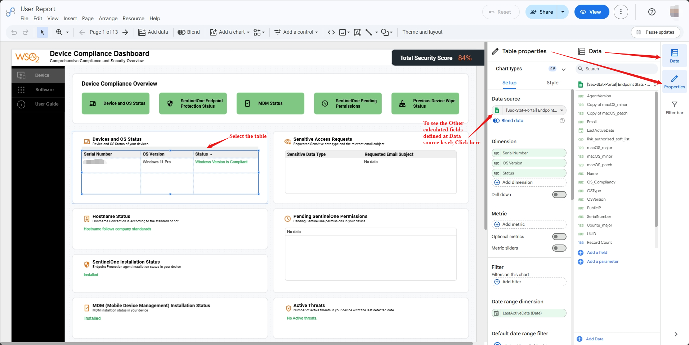
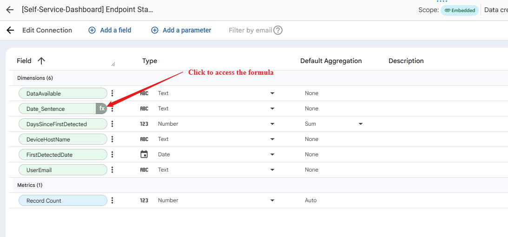
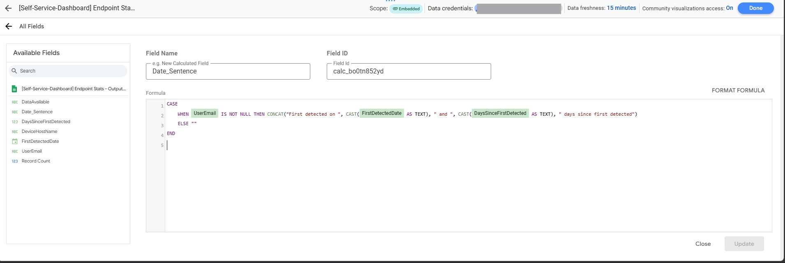
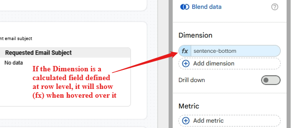
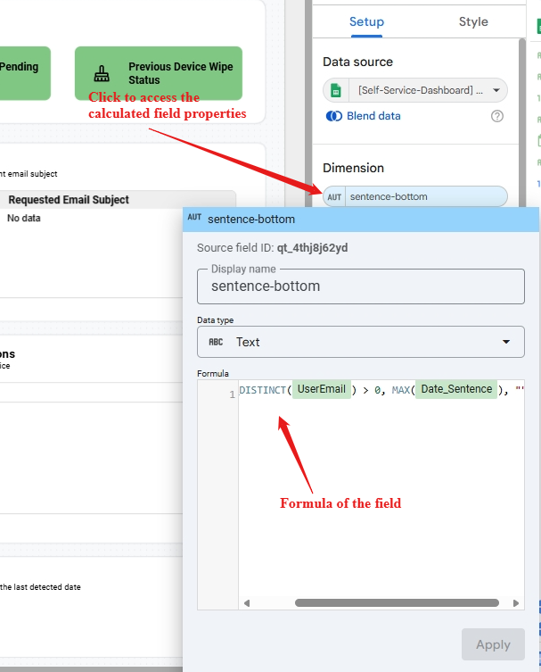
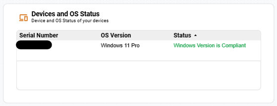
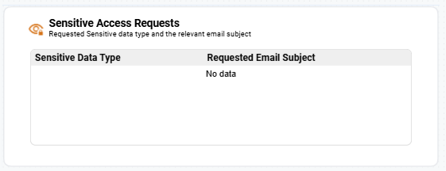
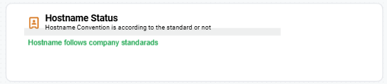

# Security and Compliance Self-Service Dashboard

## Project Description:

The Security and Compliance Self-Service Dashboard is a Looker Studio implementation designed to provide comprehensive reports for both administrators and end-users on device security compliance. The dashboard features custom calculated fields to track and grade user compliance across multiple security vectors.

Key components and features include:

- Security Scoring Logic Implementation of calculated fields to determine a "Security Score" for users based on compliance status for Mobile Device Management (MDM) and operating system (OS) version. This logic includes custom field validation for OS compliance across macOS, Windows, and Ubuntu.
- Compliance Reporting Creation of calculated fields and visualizations for Endpoint Stats, Sentinel One permissions, and unauthorized software installations.
- Data Security and Access Connecting the dashboard to Google Sheets data sources and implementing **Row-Level Security (RLS)** to restrict data access based on the user's email. _If this need to be changed the account need to have the owner access_.
- User Support Creating a user guide to assist employees in understanding their security scores

### View the Custom formula for Calculated fields:

> Data Source Level Calculated Fields <br>

<p align="center">
  
</p>
<p align="center">
  
</p>
<p align="center">
  
</p>
Report level calculated fields <br>
<p align="center">
  
</p>
<p align="center">
  
</p>

To view the fields click on the relevant chart and got to the Properties tab at the right side bar. Then click on the gsheet icon under the Data Source section.
Then from the opened tab, click on the (fx) button for the custom calculated field to view the formula for that.
In order to create a calculated field - click the “Add field” button at the top of the previous tab
To change what the table shows when a Dimension is added, click on the left section of the dimension pill and give an appropriate name.

- Conditional Formatting - Used to represent the status

There are 4 pages to the dashboard:

1. **Device Compliance Dashboard**:
   - **Total Security Score**
   - **Device Compliance Overview**: Displays the overall security using cards for each security vector (_Device and OS Status, SentinelOne Endpoint Protection Status, MDM Status, SentinelOne Pending Permissions, Previous Device Wipe Status_) using colour coded cards to indicate compliance status.
   - **Device and OS Compliance**
   - **Sensitive Access Requests**
   - **Hostname Status**
   - **Pending SentinelOne Permissions**
   - **SentinelOne Installation Status**
   - **MDM (Mobile Device Management) Installation Status**
   - **Active Threats**
   - **Previous Device Wipe Status**
   - **Recovery Key Sync Status**
2. **Software Compliance Dashboard**:
   - **Software Compliance Overview**: Displays the overall software compliance using cards for each software vector (_Unauthorized Software Installations, Software License Violations, Software Vulnerabilities_) using colour coded cards to indicate compliance status.
   - **Unauthorized Software Installations**
   - **Software License Violations**
   - **Software Vulnerabilities**
3. **User Guide**: Provides instructions and explanations for users to understand their security scores and how to improve them.
4. **Total Security Score**: Total Security Score as a percentage
5. **Score Guide**: Displays the individual security score for each security vector using conditional formatting to indicate compliance status.

## 1. Device Compliance Dashboard:

### Device and OS Compliance:

Chart Type - Table <br>

<p align="center">
  
</p> <br>
Data Source - [[Sec-Stat-Portal] Endpoint Stats - Outputs - User Endpoint List]() <br>
[Related Calculated Fields and formulae](#data-source-level-calcualted-fields) <br>
Columns

- **Serial Number** - Renamed from `SerialNumber`
- **OS Version** - Renamed from `OSType`
- **Status** - Renamed from `OS_Compliancy` calculated field
  - formula:
    ```js
    CASE
       WHEN CONTAINS_TEXT(OSType, 'macOS') THEN
          CASE
             WHEN macOS_major >= macOS THEN "MacOS Version is Compliant"
             ELSE "MacOS Version is not Compliant"
          END
       WHEN CONTAINS_TEXT(OSType, 'Windows') THEN
          CASE
             WHEN OSType = "Windows 11 Pro" THEN "Windows Version is Compliant"
             ELSE "Windows Version is not Compliant"
          END
       WHEN CONTAINS_TEXT(OSType, 'Ubuntu') THEN
          CASE
             WHEN Ubuntu_major >= Ubuntu THEN "Ubuntu Version is Compliant"
             ELSE "Ubuntu Version is not Compliant"
          END
       ELSE "N/A"
    END
    ```

### Sensitive Access Requests:

Chart Type - Table <br>

<p align="center">
  
</p> <br>
Data Source - [[Self Service Dashboard] WSO2 Sensitive Data Access Form (Responses) - Form Responses 1]() <br>
Columns

- **Sensitive Data Type** - Same as from `Sensitive Data Type`
- **Requested Email Subject** - Renamed from `Requested Email Subject`

### Hostname Status:

Chart Type - Table <br>

<p align="center">
  
</p> <br>
Data Source - [[Self-Service-Dashboard] Endpoint Stats - Outputs - Unknown S1 User Endpoints]() <br>
[Related Calculated Fields and formulae](#data-source-level-calcualted-fields) <br>
Columns - only one column with a hidden header

- **Hidden Header 1** - Calculated field (sentence-top)
  - formula:
    ```js
    IF(
      COUNT_DISTINCT(UserEmail) > 0,
      CONCAT(
        "Hostname doesn't follows company standarads",
        " [ ",
        MAX(DeviceHostName),
        " ]",
      ),
      "Hostname follows company standarads",
    );
    ```

- **Hidden Header 2** - Calculated field (sentence-bottom)
  - formula:
    ```js
    IF(COUNT_DISTINCT(UserEmail) > 0, MAX(Date_Sentence), "");
    ```

### Pending SentinelOne Permissions:

Chart Type: Table <br>
Data Source: [[Sec-Stat-Portal] Endpoint Stats - Outputs - Users in missing permissions in S1]() <br>
[Related Calculated Fields and formulae](#data-source-level-calcualted-fields) <br>
Columns

- **Hidden Header** - Calculated field `Pending Permissions`
  - formula:
    ```js
    CASE
       WHEN MAX(MissingPermissions) = "user_action_needed_fda_helper" THEN "SentineOne full disk permission is missing"
       WHEN MAX(MissingPermissions) = "user_action_needed_notifications" THEN "SentinelOne user notification permission is missing"
       WHEN MAX(MissingPermissions) = "user_action_needed_network" THEN "SentinelOne network permission is missing"
    END
    ```

### SentinelOne Installation Status:

Chart Type: Table <br>
Data Source: [Endpoints Stats - Alert - ActiveEmployeesWithoutS1OrHostNameVariations]() <br>
[Related Calculated Fields and formulae](#data-source-level-calcualted-fields) <br>
Columns

- **Hidden Header** - Calculated field `Status`
  - formula:
    ```js
    IF(
    COUNT_DISTINCT(EmailAddress) > 0,
    CASE
       WHEN MAX(Hostname) = "-" THEN CONCAT("Not Installed - ", MAX(Date_Sentence))
       WHEN MAX(Comments) = "User is in Airwatch but not in S1" THEN CONCAT("Not Installed - ", MAX(Date_Sentence))
       ELSE "Installed"
    END
    ,
    "Installed")
    ```

### MDM (Mobile Device Management) Installation Status:

Chart Type: Table <br>
Data Source: [Endpoints Stats - Alert - UsersWithoutMDM]() <br>
[Related Calculated Fields and formulae](#data-source-level-calcualted-fields) <br>
Columns

- **Hidden Header** - Calculated field `Complinace Status`
  - formula:
    ```js
    IF(
    COUNT_DISTINCT(EmailAddress) > 0,
    CASE
       WHEN CONTAINS_TEXT(MAX(OStype), "Windows") THEN CONCAT("WSO2 WorkspaceOne not installed ", MAX(Date_Sentence))
       WHEN CONTAINS_TEXT(MAX(OStype), "mac") THEN CONCAT("WSO2 WorkspaceOne not installed - ", MAX(Date_Sentence))
       WHEN CONTAINS_TEXT(MAX(OStype), "User not found in SentinelOne") THEN CONCAT("Automox not installed - ", MAX(Date_Sentence))
       ELSE "Other"
    END,
    "Installed"
    )
    ```

### Active Threats:

Chart Type: Table <br>
Data Source: [[Self-Service-Dashboard] Endpoints Alerts - InfectedUsers]() <br>
[Related Calculated Fields and formulae](#data-source-level-calcualted-fields) <br>
Columns

- **Hidden Header** - Calculated field `Status`
  - formula:
    ```js
          IF(COUNT_DISTINCT(Email) > 0,
    CONCAT(
       CAST(MAX(ActiveThreats) AS TEXT), " active threat",
          MAX(IF(MAX(ActiveThreats) > 1, "s", ""))
          ,", last active on ", CAST(MAX(LastActiveDate) AS TEXT)),
    "No Active threats.")
    ```

### Previous Device Wipe Status:

Chart Type: Table <br>
Data Sorce: [[Sec-Stat-Portal] Endpoint Stats - Outputs - Replacements Without Ack]() <br>
[Related Calculated Fields and formulae](#data-source-level-calcualted-fields) <br>
Columns

- **Hidden Header** - Calculated field `Status`
  - formula:
    ```js
    IF(COUNT_DISTINCT(Email) > 0,
    CASE
      WHEN CONTAINS_TEXT(MAX(Employment status), "Resigned") THEN "N/A"
      ELSE "Previous device is not wiped"
    END,
    "Previous device is wiped or no new device is received")
    ```

### Recovery Key Sync Status:

Chart Type: Table <br>
Data Source: [Recovery key not synced - Sheet1]() <br>
[Related Calculated Fields and formulae](#data-source-level-calcualted-fields) <br>
Columns

- **Hidden Header** - Calculated field `Status`
  - formula:
    ```js
    IF(
      COUNT_DISTINCT(Email) > 0,
      "Recovery key is not synced",
      "Recovery key is syced",
    );
    ```

## 2. Software Compliance Dashboard:

### Software License Violations

Chart Type: Table <br>
Data Source: [[Sec-Stat-Portal] Endpoint Stats - Outputs - Non-Compliant Software Installations]() <br>
[Related Calculated Fields and formulae](#data-source-level-calcualted-fields) <br>
Columns

- **Application Name** - Renamed from `ApplicationName`
- **Application Installed Path** - Renamed from `ApplicationInstalledPath`
- **Application Installed Date** - Renamed from `ApplicationInstalledDate`
- **Detected Date** - Renamed from `DetectedDate`
- **Data Available** - Renamed from `DataAvailable`

### Unauthorized Software Installations:

Chart Type: Table <br>
Data Source: [SECURITY_SCORE - Unauthorized_Software_List]() <br>
[Related Calculated Fields and formulae](#data-source-level-calcualted-fields) <br>
Columns

- **Hidden Header** - mapped to unauth_satus
  - This list is derived using a fromala in the above gsheet.

### Software Vulnerabilities:

Chart Type: Table <br>
Data Source: [[Self-Service-Dashboard] End User Vulnerabilities - Sheet1]() <br>
Columns

- **Application**
- **CVEScore**
- **CVEId**
- **Severity**

## 3. User Guide:

> The table is custom made with multiple tables as rows and text boxes. The links are using a button with a static link (control)

### Row 1: Device and OS

Chart type: Table <br>
Data source: [[Sec-Stat-Portal] Endpoint Stats - Outputs - User Endpoint List]() <br>
Columns:

- **Compliant Statement** : uses `Non_Compliant_Statement` calculated field
  - formula:
    ```js
    CASE
       WHEN CONTAINS_TEXT(OSType, 'macOS') THEN
          CASE
             WHEN OS_Compliancy = "MacOS Version is Compliant" THEN OS_Compliancy
             ELSE CONCAT("Non Compliant macOS Version Detected [Device SerialNumber-",SerialNumber,"]")
          END
          WHEN CONTAINS_TEXT(OSType, 'Windows') THEN
          CASE
             WHEN OS_Compliancy = "Windows Version is Compliant" THEN OS_Compliancy
             ELSE CONCAT("Not Compliant Windows Version Detected[Device SerialNumber-",SerialNumber,"]")
          END
       WHEN CONTAINS_TEXT(OSType, 'Ubuntu') THEN
          CASE
             WHEN OS_Compliancy = "Ubuntu Version is Compliant" THEN OS_Compliancy
             ELSE CONCAT("Not Compliant Ubuntu Version Detected[Device SerialNumber-",SerialNumber,"]")
          END
       ELSE "N/A"
    END
    ```

- **action** :
  - formula:

    ```js
    CASE
       WHEN CONTAINS_TEXT(OSType, 'macOS') AND OS_Compliancy != "MacOS Version is Compliant"
          THEN "Update macOS to the latest Version"

       WHEN CONTAINS_TEXT(OSType, 'Windows') AND OS_Compliancy != "Windows Version is Compliant"
          THEN "Update Windows to the latest Version"

       WHEN CONTAINS_TEXT(OSType, 'Ubuntu') AND OS_Compliancy != "Ubuntu Version is Compliant"
          THEN "Update Ubuntu to the latest Version"
       ELSE "No Action Required"
    END
    ```

### Row 2: Device Wipe Status

Chart type: Table <br>
Data source: [[Sec-Stat-Portal] Endpoint Stats - Outputs - Replacements Without Ack]() <br>
Columns:

- **Compliance Statement** : uses `Wiped_Status` calculated field
  - formula
    ```js
    IF(COUNT_DISTINCT(Email) > 0,
       CASE
          WHEN CONTAINS_TEXT(MAX(Employment status), "Resigned")
          THEN "No Action Required"
          ELSE "Format previous device and submit the evidence"
       END,
    "No Action Required"
    )
    ```
- **action** :
  - formula
    ```js
    IF(COUNT_DISTINCT(Email) > 0,
       CASE
          WHEN CONTAINS_TEXT(MAX(Employment status), "Resigned")
          THEN "No Action Required"
          ELSE "Format previous device and submit the evidence"
       END,
    "No Action Required"
    )
    ```

### Row 3: Hostname

Chart type: Table <br>
Data source: [[Self-Service-Dashboard] Endpoint Stats - Outputs - Unknown S1 User Endpoints]() <br>
Columns:

- **Compliance Statement** : uses `CompliancyStatement` calculated field
  - formula
    ```js
    IF(
      COUNT_DISTINCT(UserEmail) > 0,
      "Hostname doesn't follows company standarads",
      "Hostname follows company standarads",
    );
    ```
- **action** :
  - formula
    ```js
    IF(
      COUNT_DISTINCT(UserEmail) > 0,
      MAX(
        CONCAT(
          "Change the host name to '",
          "'",
          REGEXP_REPLACE(UserEmail, "@.*", ""),
          "'",
          "'",
        ),
      ),
      "No Action Required",
    );
    ```

### Row 4: MDM

Chart type: Table <br>
Data source: [Endpoints Stats - Alert - UsersWithoutMDM]() <br>
Columns:

- **Compliance Statement** : uses `CompliancyStatement` calculated field
  - formula
    ```js
    IF(
    COUNT_DISTINCT(EmailAddress) > 0,
    CASE
       WHEN CONTAINS_TEXT(MAX(OStype), "Windows") THEN CONCAT("WSO2 WorkspaceOne is not installed ", MAX(Date_Sentence))
       WHEN CONTAINS_TEXT(MAX(OStype), "mac") THEN CONCAT("WSO2 WorkspaceOne is not installed - ", MAX(Date_Sentence))
       WHEN CONTAINS_TEXT(MAX(OStype), "User not found in SentinelOne") THEN CONCAT("Automox is not installed - ", MAX(Date_Sentence))
       ELSE "Other"
    END,
    "MDM is Compliant"
    )
    ```
- **action** :
  - formula
    ```js
    IF(COUNT_DISTINCT(EmailAddress) > 0,
       CASE
       WHEN CONTAINS_TEXT(MAX(OStype), "Windows") THEN "Install WSO2 WorkspaceOne"
       WHEN CONTAINS_TEXT(MAX(OStype), "mac") THEN "Install WSO2 WorkspaceOne"
       WHEN CONTAINS_TEXT(MAX(OStype), "User not found in SentinelOne") THEN "Install Automox"
       ELSE "Other"
    END,
    "No Action Required"
    )
    ```

### Row 5: Recovery Key

Chart type: Table <br>
Data source: [Recovery key not synced - Sheet1]() <br>
Columns:

- **Compliance Statement** : uses `CompliancyStatement` calculated field
  - formula
    ```js
    IF(COUNT_DISTINCT(Email) > 0, "Recovery Key Not Synced", "Synced");
    ```
- **action** :
  - formula
    ```js
    IF(
      COUNT_DISTINCT(Email) > 0,
      "Sync the Recovery Key with WorkspaceOne",
      "No Action Required",
    );
    ```

### Row 6: SentinelOne

Chart type: Table <br>
Data source: [Endpoints Stats - Alert - ActiveEmployeesWithoutS1OrHostNameVariations]() <br>
Columns:

- **Compliance Statement** : uses `CompliancyStatement` calculated field
  - formula
    ```js
    IF(
    COUNT_DISTINCT(EmailAddress) > 0,
    CASE
       WHEN MAX(Hostname) = "-" THEN "SentinelOne is not Installed"
       ELSE "SentinelOne is Compliant"
    END
    ,
    "SentinelOne is Compliant")
    ```
- **action** :
  - formula
    ```js
    IF(COUNT_DISTINCT(EmailAddress) > 0,
    CASE
       WHEN MAX(Hostname) = "-" THEN "Install SentinelOne"
       ELSE "No Action Required"
    END,
    "No Action Required"
    )
    ```

### Row 7: SentinelOne Permissions

Chart type: Table <br>
Data source: [[Sec-Stat-Portal] Endpoint Stats - Outputs - Users in missing permissions in S1]() <br>
Columns:

- **Compliance Statement** : uses `CompliancyStatement` calculated field
  - formula
    ```js
    IF(
      COUNT_DISTINCT(Email) > 0,
      "Missing Permissions Detected",
      "No missing permissions",
    );
    ```
- **action** :
  - formula
    ```js
    IF(COUNT_DISTINCT(Email) > 0,
    CASE
       WHEN MAX(MissingPermissions) = "user_action_needed_fda_helper" THEN "Please grant full disk permission to agent"
       WHEN MAX(MissingPermissions) = "user_action_needed_notifications" THEN "Please grant user notification permission to agent"
       WHEN MAX(MissingPermissions) = "user_action_needed_network" THEN "Please grant network permission to agent"
    END
    ,
    "No Action Required")
    ```

### Row 8: Software License Violations

Chart type: Table <br>
Data source: [[Sec-Stat-Portal] Endpoint Stats - Outputs - Non-Compliant Software Installations]() <br>
Columns:

- **Compliance Statement** : uses `CompliancyStatement` calculated field
  - formula
    ```js
    IF(
      COUNT_DISTINCT(Email) > 0,
      "Software License Violations Detected",
      "No license violations detected",
    );
    ```
- **action** :
  - formula
    ```js
    IF(
      COUNT_DISTINCT(Email) > 0,
      "Please remove the relevant software",
      "No Action Required",
    );
    ```

### Row 9: Software Vulnerabilities

Chart type: Table <br>
Data source: [[Self-Service-Dashboard] End User Vulnerabilities - Sheet1]() <br>
Columns:

- **Compliance Statement** : uses `CompliancyStatement` calculated field
  - formula
    ```js
    IF(
      COUNT_DISTINCT(Email) > 0,
      "Software Vulnerabilities Detected",
      "No Vulnerabilities Detected",
    );
    ```
- **action** :
  - formula
    ```js
    IF(
      COUNT_DISTINCT(Email) > 0,
      "Please update the application to the latest version available",
      "No Action Required",
    );
    ```

### Row 10: Unauthorized Software Installations

Chart type: Table <br>
Data source: [SECURITY_SCORE - Unauthorized_Software_List]() <br>
Columns:

- **Compliance Statement** : uses `CompliancyStatement` calculated field
  - formula
    ```js
    IF(
      COUNT_DISTINCT(Email) > 0,
      "Unauthorized Software Installations Detected",
      "No Unauthorized Softwares Detected",
    );
    ```
- **action** :
  - formula
    ```js
    IF(
      COUNT_DISTINCT(Email) > 0,
      "Please remove the unauthorized softwares",
      "No Action Required",
    );
    ```

## 4. Total Security Score:

Chart type: Score Card
Data Source: [[Sec-Stat-Portal] Endpoint Stats - Outputs - User Endpoint List]() <br>
[Related Calculated Fields and formulae](#data-source-level-calcualted-fields) <br>

- **Total Security Score** - Calculated field `Final_Calculated_Field`
  - formula:
    ```js
    Final_Score * 100;
    ```

## 5. Score Guide:

> using score cards with 100 border radius for the icon backgrouds. And has conditional formatiing to display _Green_, _Yellow_ and _Red_ based on the score. (Uses [SECUROTY_SCORE - security_score]() as Data Source ) <br>
> score cards for the scores as well. <br>
> Has used Data blends for every following Score cards. (Table 1 - [SECUROTY_SCORE - Default_Scores]() & Table 2 - [SECUROTY_SCORE - security_score]() with a **Cross join**)

- **Device and OS** : `D&O_Score` Calculated field
  - formula:
    ```js
    CONCAT(OS Score,"/",Devices and OS Default Score)
    ```
  - Icon bg: `OS Score` Field

- **MDM** : `MDM_Score` Calculated field
  - formula:

    ```js
    CONCAT(MDM Score,"/",Devices and OS Default Score)
    ```

  - Icon bg: `MDM Score` Field

- **SentinelOne** : `S1_Score` Calculated field
  - formula:

    ```js
    CONCAT(Antivirus Score,"/",Sentinel One Default Score)
    ```

  - Icon bg: `Antivirus Score` Field

- **Previous Device Wipe Status** : `PDW_Score` Calculated field
  - formula:

    ```js
    CONCAT(Wipe Score,"/",Previous Device Default Score)
    ```

  - Icon bg: `Wipe Score` Field

- **SentinelOne Pending Permissions** : `SIPP_Score` Calculated field
  - formula:

    ```js
    CONCAT(S1 Permission Score,"/",Pending Permissions Default Score )
    ```

  - Icon bg: `S1 Permission Score` Field

- **Software License Violations** : `SLV_Score` Calculated field
  - formula:

    ```js
    CONCAT(Software License Violation Score,"/",Software License Violations Default Score )
    ```

  - Icon bg: `Software License Violation Score` Field

- **Unauthorized Software Installations** : `USI_Score` Calculated field
  - formula:

    ```js
    CONCAT(Software Compliance Score,"/",Unauthorized Software Installtions Default Score )
    ```

  - Icon bg: `Software Compliance Score` Field

- **Software Vulnerabilities** : `SV_Score` Calculated field
  - formula:

    ```js
    CONCAT(App Vulnerability Score,"/",Software Vulnerabilities Default Score )
    ```

  - Icon bg: `App Vulnerability Score` Field

## **Data Source Level Calcualted Fields:**

### 1. [[Sec-Stat-Portal] Endpoint Stats - Outputs - User Endpoint List]()

- Copy of macOS_minor
  - formula:
    ```js
    IF(CONTAINS_TEXT(OSType, 'macOS'), CAST(REGEXP_EXTRACT(OSVersion, '^\\.(\\d+)') AS NUMBER), 0000)
    ```
- Copy of macOS_patch
  - formula:
    ```js
    IF(CONTAINS_TEXT(OSType, 'macOS'), CAST(REGEXP_EXTRACT(OSVersion, '^\\.\\d+\\.(\\d+)') AS NUMBER), 0000)
    ```
- link_authorized_soft_list
  - formula:

    ```js
          HYPERLINK(
          IF(
            OS_Compliancy = "macOS Version Not Compliant!"
          OR OS_Compliancy = "Windows Version Not Compliant!"
          OR OS_Compliancy = "Ubuntu Version Not Compliant!", "{{RECOMMENDED_OS_SHEET_LINK}}",""
          )
          ,
          IF(
          OS_Compliancy = "macOS Version Not Compliant!"
          OR OS_Compliancy = "Windows Version Not Compliant!"
          OR OS_Compliancy = "Ubuntu Version Not Compliant!", "Recommended OS List","No Action Needed"
          )
          )
    ```

- macOS_major
  - formula:
    ```js
    IF(CONTAINS_TEXT(OSType, 'macOS'), CAST(REGEXP_EXTRACT(OSVersion, '^(\\d+)') AS NUMBER), 0000)
    ```
- macOS_minor
  - formula:
    ```js
    IF(CONTAINS_TEXT(OSType, 'macOS'), CAST(REGEXP_EXTRACT(OSVersion, '^\\.(\\d+)') AS NUMBER), 0000)
    ```
- macOS_patch
  - formula:
    ```js
    IF(CONTAINS_TEXT(OSType, 'macOS'), CAST(REGEXP_EXTRACT(OSVersion, '^\\.\\d+\\.(\\d+)') AS NUMBER), 0000)
    ```
- OS_Compliancy
  - formula:
    ```js
      CASE
      WHEN CONTAINS_TEXT(OSType, 'macOS') THEN
      CASE
      WHEN macOS_major >= macOS THEN "MacOS Version is Compliant"
      ELSE "MacOS Version is not Compliant"
      END
      WHEN CONTAINS_TEXT(OSType, 'Windows') THEN
      CASE
      WHEN OSType = "Windows 11 Pro" THEN "Windows Version is Compliant"
      ELSE "Windows Version is not Compliant"
      END
      WHEN CONTAINS_TEXT(OSType, 'Ubuntu') THEN
      CASE
      WHEN Ubuntu_major >= Ubuntu THEN "Ubuntu Version is Compliant"
      ELSE "Ubuntu Version is not Compliant"
      END
      ELSE "N/A"
      END
    ```
- Ubuntu_major
  - formula:
    ```js
      IF(CONTAINS_TEXT(OSType, 'Ubuntu'), CAST(REGEXP_EXTRACT(OSVersion , 'Ubuntu\\s+(\\d+)\\.') AS NUMBER), 0000)
    ```
- Parameters
  - macOS
  - Ubuntu
  - Windows

### 2. [Endpoints Stats - Alert - ActiveEmployeesWithoutS1OrHostNameVariations]()

- Date_Sentence
  - formula:
    ```js
    CASE
    WHEN EmailAddress IS NOT NULL THEN CONCAT("First detected on ", CAST(FirstDetectedDate AS TEXT), " and ", CAST(DaysSinceFirstDetected AS TEXT), " days since first detected")
    ELSE ""
    END
    ```

- Host Name Status
  - formula:
    ```js
    IF(
    COUNT_DISTINCT(EmailAddress) > 0,
    CASE
    WHEN MAX(Comments) = "Host name mismatch"
    THEN CONCAT(MAX(Comments), " [ ", MAX(Hostname), " ]")
    WHEN MAX(Comments) = "User is in Airwatch but not in S1"
    THEN CONCAT("SentinelOne Not Installed! - ", MAX(Hostname))
    ELSE "Host Name Not Found!"
    END,
    MAX(REGEXP_EXTRACT(EmailAddress, '^(.+)@'))
    )
    ```

### 3. [Endpoints Stats - Alert - UsersWithoutMDM]()

- Date_Sentence
  - formula:
    ```js
      CASE
      WHEN EmailAddress IS NOT NULL THEN CONCAT("First detected on ", CAST(FirstDetectedDate AS TEXT), " and ", CAST(DaysSinceFirstDetected AS TEXT), " days since first detected")
      ELSE ""
      END
    ```
- Operating System
  - formula:
    ```js
      CASE
      WHEN OStype = "User not found in SentinelOne" THEN "Ubuntu"
      ELSE OStype
      END
    ```

### 4. [SECURITY_SCORE - security_score]()

- Antivirus Score
  - formula:
    ```js
    20 - Antivirus;
    ```
- App Vulnerability Score
  - formula:
    ```js
    8 - App_Vuln;
    ```
- Final_Calculated_Field
  - formula:
    ```js
    Final_Score * 100;
    ```
- MDM Score
  - formula:
    ```js
    12 - MDM;
    ```
- OS Score
  - formula:
    ```js
    12 - OS_Version;
    ```
- S1 Permission Score
  - formula:
    ```js
    12 - S1_Perm;
    ```
- Software Compliance Score
  - formula:
    ```js
    8 - Unauth_SW;
    ```
- Software License Violation Score
  - formula:
    ```js
    20 - Prohibited;
    ```
- Wipe Score
  - formula:
    ```js
    8 - Wipe;
    ```

  ## Formulae for Gsheets

  ### [SECURITY_SCORE - security_score]() Sheet formulae

  > ArrayFormulae for the Score Calculation Fields in score_sheet
  1. MDM Score

  ```js
  =ARRAYFORMULA(IF(LEN(A2:A)=0,,IF(ISNUMBER(MATCH(A2:A, IMPORTRANGE("{{ENDPOINT_STATS_SHEET_ID}}", "UsersWithoutMDM!A:A"), 0)), 12, 0)))
  ```

  2. Antivirus/SentinelOne Score

  ```js
  =ARRAYFORMULA(
  IF(ROW(C2:C)=1,"Antivirus",
  IF(A2:A="","",
  LET(
    Hostname, IFERROR(VLOOKUP(A2:A, IMPORTRANGE("{{ENDPOINT_STATS_SHEET_LINK}}", "ActiveEmployeesWithoutS1OrHostNameVariations!A:E"), 5, FALSE), ""),
    IF(Hostname="-",20,0)
  )
  )
  )
  )
  ```

  3. S1_Perm Score

  ```js
  =ARRAYFORMULA(IF(ISBLANK(A2:A), "", IF(ISNA(MATCH(A2:A, IMPORTRANGE("{{SEC_STAT_PORTAL_SHEET_ID}}", "Users in missing permissions in S1!E:E"), 0)), 0, 12)))
  ```

  4. Wipe Score

  ```js
  =ARRAYFORMULA(IF(ISBLANK(A2:A), "", IF(ISNA(MATCH(A2:A, IMPORTRANGE("{{SEC_STAT_PORTAL_SHEET_ID}}", "Replacements Without Ack!A:A"), 0)), 0, 8)))
  ```

  5. Prohibited Score

  ```js
  =ARRAYFORMULA(IF(A2:A = "",, LET(imported_emails, IMPORTRANGE("{{SEC_STAT_PORTAL_SHEET_ID}}", "Non-Compliant Software Installations!J2:J"), email_exists_count, COUNTIF(imported_emails, A2:A), IF(email_exists_count > 0, 20, 0))))
  ```

  6. Unauth_SW Score

  ```js
  =ARRAYFORMULA(
  IF(A2:A="",,
  LET(
  emails, A2:A,
  counts, COUNTIF(Unauthorized_Software_List!A2:A, emails),
  IF(counts > 2, 8,
    IF(counts > 0, 4, 0)
  )
  )
  )
  )
  ```

  7. App_Vuln

  ```js
  =ARRAYFORMULA(
  IF(A2:A="",,
  LET(
  emails, A2:A,
  counts, COUNTIF(Sheet8!A2:A, emails),
  IF(counts > 2, 8,
    IF(counts > 0, 4, 0)
  )
  )
  )
  )
  ```

  8. OS_Version

  ```js
  =LET(
  REMOTE_URL, "{{SEC_STAT_PORTAL_SHEET_LINK}}",
  source_data, IMPORTRANGE(REMOTE_URL, "'User Endpoint List'!A:I"),
  email_col, INDEX(source_data, , 9),
  os_col, INDEX(source_data, , 5),

  MAP(A2:A, LAMBDA(current_email,
  IF(current_email = "", "",
  LET(
    found_os, XLOOKUP(current_email, email_col, os_col, "Not Found"),
    IFS(
      found_os = "Not Found", 0,
      REGEXMATCH(found_os, "macOS"), IF(VALUE(REGEXEXTRACT(found_os, "macOS (\d+)")) >= 14, 0, 12),
      REGEXMATCH(found_os, "Ubuntu"), IF(VALUE(REGEXEXTRACT(found_os, "Ubuntu (\d+)")) >= 22, 0, 12),
      REGEXMATCH(found_os, "Windows"), IF(found_os = "Windows 11 Pro", 0, 12),
      TRUE, 12
    )
  )
  )
  ))
  )
  ```

  9. Minus_Score

  ```js
  =ARRAYFORMULA(IF(A2:A="",, BYROW(B2:I, LAMBDA(row, SUM(row)))))
  ```

  10. Final_Score

  ```js
  =ARRAYFORMULA(IF(A2:A="",, (100 - J2:J) / 100))
  ```

  ### **Other Sheets in SECURITY_SCORE**
  1. Replacements_Without_Ack

  ```js
  =ARRAYFORMULA(IF(A2:A="",, (100 - J2:J) / 100))
  ```

  2. Sheet8

  ```js
  =LET(IMPORTRANGE("{{USER_VULNERABILITIES_SHEET_ID}}", "Sheet1!J2:J"))
  ```

  3. Unauthorized_Software_List (Custom Sheet)

  ```js
  =LET(
  imported_data,
  IMPORTRANGE("{{UNAUTHORIZED_SOFTWARE_SHEET_LINK}}", "Sheet1!B2:C"),

  emails,
  INDEX(imported_data,,1),

  software_lists,
  INDEX(imported_data,,2),

  QUERY(
  ARRAYFORMULA(
  SPLIT(
    FLATTEN(emails & "|" & SPLIT(software_lists, ",")),
    "|"
  )
  ),
  "SELECT Col1, Col2 WHERE Col2 IS NOT NULL AND Col2 != ''"
  )
  )
  ```
